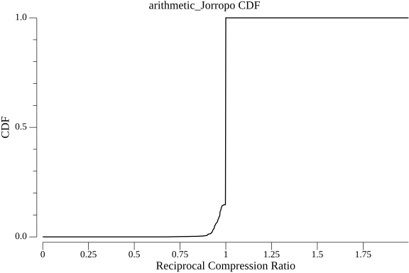

# Meshtastic Compression Showdown

This project contains benchmarks of various compression algorithms applied on a dataset of meshtastic packets.

For context a Reciprocal Compression Ratio **above** 1 means the compressed data is **bigger** than the uncompressed data.
A ratio **below** 1 means the compressed data is **smaller** than the uncompressed data.

## Per-Portnum Compression Summary

| Compressor                                    | P1 (TEXT_MESSAGE_APP) | P3 (POSITION_APP) | P4 (NODEINFO_APP) | P5 (ROUTING_APP) | P67 (TELEMETRY_APP) | P70 (TRACEROUTE_APP) | P71 (NEIGHBORINFO_APP) |
| --------------------------------------------- | --------------------- | ----------------- | ----------------- | ---------------- | ------------------- | -------------------- | ---------------------- |
| `unishox2_alpha_only`                         | 0.6555                | 1.0000            | 1.0000            | 1.0000           | 1.0000              | 1.0000               | 1.0000                 |
| `snowflake_Jorropo`                           | 0.6790                | 1.0000            | 0.7660            | 1.0000           | 1.0000              | 1.0000               | 1.0000                 |
| `unishox2_alpha_num_only`                     | 0.6894                | 1.0000            | 1.0000            | 1.0000           | 1.0000              | 1.0000               | 1.0000                 |
| `unishox2_no_uni_favor_text`                  | 0.7102                | 1.0000            | 1.0000            | 1.0000           | 1.0000              | 1.0000               | 1.0000                 |
| `unishox2_favor_alpha`                        | 0.7132                | 1.0000            | 1.0000            | 1.0000           | 1.0000              | 1.0000               | 1.0000                 |
| `unishox2_alpha_num_sym_only`                 | 0.7159                | 1.0000            | 1.0000            | 1.0000           | 1.0000              | 1.0000               | 1.0000                 |
| `unishox2_alpha_num_sym_only_text`            | 0.7159                | 1.0000            | 1.0000            | 1.0000           | 1.0000              | 1.0000               | 1.0000                 |
| `meshtasticmodel_V10_EgonElbre`               | 0.7171                | 0.9454            | 0.9687            | 0.7898           | 0.9495              | 0.9737               | 0.9868                 |
| `meshtasticmodel_V8_EgonElbre`                | 0.7171                | 0.9454            | 0.9687            | 0.7898           | 0.9495              | 0.9737               | 0.9868                 |
| `meshtasticmodel_V9_EgonElbre`                | 0.7171                | 0.9454            | 0.9687            | 0.7898           | 0.9495              | 0.9737               | 0.9868                 |
| `meshtasticmodel_V1_EgonElbre`                | 0.7175                | 0.9448            | 0.9661            | 0.7829           | 0.9503              | 0.9737               | 0.9868                 |
| `meshtasticmodel_V4_EgonElbre`                | 0.7175                | 0.9448            | 0.9661            | 0.7829           | 0.9503              | 0.9737               | 0.9868                 |
| `meshtasticmodel_V5_EgonElbre`                | 0.7175                | 0.9448            | 0.9661            | 0.7829           | 0.9503              | 0.9737               | 0.9868                 |
| `meshtasticmodel_V6_EgonElbre`                | 0.7175                | 0.9448            | 0.9661            | 0.7829           | 0.9503              | 0.9737               | 0.9868                 |
| `meshtasticmodel_V7_EgonElbre`                | 0.7175                | 0.9461            | 0.9694            | 0.8138           | 0.9495              | 0.9737               | 0.9868                 |
| `meshtasticmodel_V3_EgonElbre`                | 0.7186                | 0.9496            | 0.9691            | 0.8025           | 0.9621              | 0.9737               | 0.9868                 |
| `unishox2_json_no_uni`                        | 0.7194                | 1.0000            | 1.0000            | 1.0000           | 1.0000              | 1.0000               | 1.0000                 |
| `unishox2_no_uni`                             | 0.7194                | 1.0000            | 1.0000            | 1.0000           | 1.0000              | 1.0000               | 1.0000                 |
| `unishox2_default`                            | 0.7236                | 1.0000            | 1.0000            | 1.0000           | 1.0000              | 1.0000               | 1.0000                 |
| `unishox2_html`                               | 0.7236                | 1.0000            | 1.0000            | 1.0000           | 1.0000              | 1.0000               | 1.0000                 |
| `unishox2_json`                               | 0.7236                | 1.0000            | 1.0000            | 1.0000           | 1.0000              | 1.0000               | 1.0000                 |
| `unishox2_url`                                | 0.7236                | 1.0000            | 1.0000            | 1.0000           | 1.0000              | 1.0000               | 1.0000                 |
| `unishox2_xml`                                | 0.7236                | 1.0000            | 1.0000            | 1.0000           | 1.0000              | 1.0000               | 1.0000                 |
| `unishox2_no_dict`                            | 0.7240                | 1.0000            | 1.0000            | 1.0000           | 1.0000              | 1.0000               | 1.0000                 |
| `unishox2_favor_dict`                         | 0.7252                | 1.0000            | 1.0000            | 1.0000           | 1.0000              | 1.0000               | 1.0000                 |
| `unishox2_favor_sym`                          | 0.7302                | 1.0000            | 1.0000            | 1.0000           | 1.0000              | 1.0000               | 1.0000                 |
| `unishox2_favor_umlaut`                       | 0.7313                | 1.0000            | 1.0000            | 1.0000           | 1.0000              | 1.0000               | 1.0000                 |
| `shoco_TextEn_tmthrgd_Jorropo`                | 0.7768                | 1.0000            | 1.0000            | 1.0000           | 1.0000              | 1.0000               | 1.0000                 |
| `meshtasticmodel_V2_EgonElbre`                | 0.7794                | 1.0000            | 1.0000            | 1.0000           | 1.0000              | 1.0000               | 1.0000                 |
| `smaz_cespare_Jorropo`                        | 0.7806                | 1.0000            | 1.0000            | 1.0000           | 1.0000              | 1.0000               | 1.0000                 |
| `shoco_TextEn_tmthrgd`                        | 0.8145                | 1.0000            | 0.9997            | 1.0000           | 1.0000              | 1.0000               | 1.0000                 |
| `arithmetic_Jorropo`                          | 0.8264                | 0.9956            | 0.9886            | 1.0000           | 0.9997              | 1.0000               | 0.8675                 |
| `arithmetic_Tom`                              | 0.8264                | 0.9956            | 0.9886            | 1.0000           | 0.9997              | 1.0000               | 0.8675                 |
| `smaz_cespare`                                | 0.8283                | 1.0000            | 1.0000            | 1.0000           | 1.0000              | 1.0000               | 1.0000                 |
| `shoco_WordsEn_tmthrgd_Jorropo`               | 0.8499                | 1.0000            | 1.0000            | 1.0000           | 1.0000              | 1.0000               | 1.0000                 |
| `shoco_Emails_tmthrgd_Jorropo`                | 0.8799                | 1.0000            | 1.0000            | 1.0000           | 1.0000              | 1.0000               | 1.0000                 |
| `shoco_WordsEn_tmthrgd`                       | 0.8861                | 1.0000            | 0.9998            | 1.0000           | 1.0000              | 1.0000               | 1.0000                 |
| `shoco_FilePath_tmthrgd_Jorropo`              | 0.8899                | 1.0000            | 1.0000            | 1.0000           | 1.0000              | 1.0000               | 1.0000                 |
| `shoco_Emails_tmthrgd`                        | 0.9130                | 1.0000            | 0.9999            | 1.0000           | 1.0000              | 1.0000               | 1.0000                 |
| `shoco_FilePath_tmthrgd`                      | 0.9246                | 1.0000            | 0.9999            | 1.0000           | 1.0000              | 1.0000               | 1.0000                 |
| `arithmetic`                                  | 0.9326                | 0.9946            | 0.9996            | 1.0000           | 0.9999              | 1.0000               | 1.0000                 |
| `meshtasticmodel_pbmodel-o1_EgonElbre`        | 0.9473                | 0.9448            | 0.9618            | 0.7809           | 0.9495              | 0.9737               | 0.9868                 |
| `meshtasticmodel_pbmodel-o2_EgonElbre`        | 0.9473                | 0.9448            | 0.9618            | 0.7809           | 0.9495              | 0.9737               | 0.9868                 |
| `meshtasticmodel_pbmodel-varint-o1_EgonElbre` | 0.9473                | 0.9448            | 0.9618            | 0.7809           | 0.9495              | 0.9737               | 0.9868                 |
| `meshtasticmodel_pbmodel-varint-o2_EgonElbre` | 0.9473                | 0.9448            | 0.9618            | 0.7809           | 0.9495              | 0.9737               | 0.9868                 |
| `meshtasticmodel_pbmodel-varint_EgonElbre`    | 0.9473                | 0.9448            | 0.9618            | 0.7809           | 0.9495              | 0.9737               | 0.9868                 |
| `meshtasticmodel_pbmodel_EgonElbre`           | 0.9473                | 0.9448            | 0.9618            | 0.7809           | 0.9495              | 0.9737               | 0.9868                 |
| `flate_klauspost`                             | 0.9615                | 0.9990            | 0.9993            | 1.0000           | 1.0000              | 0.3070               | 0.8808                 |
| `flate_std`                                   | 0.9707                | 1.0000            | 1.0000            | 1.0000           | 1.0000              | 0.2719               | 0.9073                 |
| `zlib_klauspost`                              | 0.9773                | 1.0000            | 1.0000            | 1.0000           | 1.0000              | 0.3596               | 0.9205                 |
| `lzw_std`                                     | 0.9788                | 1.0000            | 1.0000            | 1.0000           | 1.0000              | 0.4211               | 0.8543                 |
| `zlib_std`                                    | 0.9827                | 1.0000            | 1.0000            | 1.0000           | 1.0000              | 0.3246               | 0.9470                 |
| `lz4_cloudflareHC`                            | 0.9881                | 0.9992            | 0.9999            | 1.0000           | 1.0000              | 0.2719               | 0.9139                 |
| `lz4_cloudflare`                              | 0.9885                | 0.9992            | 0.9999            | 1.0000           | 1.0000              | 0.2719               | 0.9536                 |
| `gzip_klauspost`                              | 0.9908                | 1.0000            | 1.0000            | 1.0000           | 1.0000              | 0.4649               | 1.0000                 |
| `gzip_std`                                    | 0.9919                | 1.0000            | 1.0000            | 1.0000           | 1.0000              | 0.4298               | 1.0000                 |
| `lz4_pierrec`                                 | 0.9954                | 1.0000            | 1.0000            | 1.0000           | 1.0000              | 0.4386               | 1.0000                 |
| `s2_klauspost`                                | 0.9954                | 1.0000            | 1.0000            | 1.0000           | 1.0000              | 0.4386               | 1.0000                 |
| `snappy_klauspost`                            | 0.9954                | 1.0000            | 1.0000            | 1.0000           | 1.0000              | 0.4386               | 1.0000                 |
| `noop`                                        | 1.0000                | 1.0000            | 1.0000            | 1.0000           | 1.0000              | 1.0000               | 1.0000                 |
| `rle_inkyblackness`                           | 1.0000                | 1.0000            | 0.9999            | 1.0000           | 0.9999              | 0.5877               | 1.0000                 |

## Dictionary/Model Sizes

| Compressor | Dictionary Size (bytes) |
|------------|------------------------|
| `arithmetic` | 7196 |
| `arithmetic_Jorropo` | 7196 |
| `arithmetic_Tom` | 7196 |
| `flate_klauspost` | 0 (algorithm-based) |
| `flate_std` | 0 (algorithm-based) |
| `gzip_klauspost` | 0 (algorithm-based) |
| `gzip_std` | 0 (algorithm-based) |
| `lz4_cloudflare` | 0 (algorithm-based) |
| `lz4_cloudflareHC` | 0 (algorithm-based) |
| `lz4_pierrec` | 0 (algorithm-based) |
| `lzw_std` | 0 (algorithm-based) |
| `meshtasticmodel_V10_EgonElbre` | 4096 |
| `meshtasticmodel_V1_EgonElbre` | 4096 |
| `meshtasticmodel_V2_EgonElbre` | 4096 |
| `meshtasticmodel_V3_EgonElbre` | 4096 |
| `meshtasticmodel_V4_EgonElbre` | 4096 |
| `meshtasticmodel_V5_EgonElbre` | 4096 |
| `meshtasticmodel_V6_EgonElbre` | 4096 |
| `meshtasticmodel_V7_EgonElbre` | 4096 |
| `meshtasticmodel_V8_EgonElbre` | 4096 |
| `meshtasticmodel_V9_EgonElbre` | 4096 |
| `meshtasticmodel_pbmodel-o1_EgonElbre` | 8192 |
| `meshtasticmodel_pbmodel-o2_EgonElbre` | 8192 |
| `meshtasticmodel_pbmodel-varint-o1_EgonElbre` | 8192 |
| `meshtasticmodel_pbmodel-varint-o2_EgonElbre` | 8192 |
| `meshtasticmodel_pbmodel-varint_EgonElbre` | 8192 |
| `meshtasticmodel_pbmodel_EgonElbre` | 8192 |
| `noop` | 0 (algorithm-based) |
| `rle_inkyblackness` | 0 (algorithm-based) |
| `s2_klauspost` | 0 (algorithm-based) |
| `shoco_Emails_tmthrgd` | 1024 |
| `shoco_Emails_tmthrgd_Jorropo` | 1024 |
| `shoco_FilePath_tmthrgd` | 2048 |
| `shoco_FilePath_tmthrgd_Jorropo` | 2048 |
| `shoco_TextEn_tmthrgd` | 4096 |
| `shoco_TextEn_tmthrgd_Jorropo` | 4096 |
| `shoco_WordsEn_tmthrgd` | 3072 |
| `shoco_WordsEn_tmthrgd_Jorropo` | 3072 |
| `smaz_cespare` | 1280 |
| `smaz_cespare_Jorropo` | 1280 |
| `snappy_klauspost` | 0 (algorithm-based) |
| `snowflake_Jorropo` | 512 |
| `unishox2_alpha_num_only` | 0 (algorithm-based) |
| `unishox2_alpha_num_sym_only` | 0 (algorithm-based) |
| `unishox2_alpha_num_sym_only_text` | 0 (algorithm-based) |
| `unishox2_alpha_only` | 0 (algorithm-based) |
| `unishox2_default` | 0 (algorithm-based) |
| `unishox2_favor_alpha` | 0 (algorithm-based) |
| `unishox2_favor_dict` | 0 (algorithm-based) |
| `unishox2_favor_sym` | 0 (algorithm-based) |
| `unishox2_favor_umlaut` | 0 (algorithm-based) |
| `unishox2_html` | 0 (algorithm-based) |
| `unishox2_json` | 0 (algorithm-based) |
| `unishox2_json_no_uni` | 0 (algorithm-based) |
| `unishox2_no_dict` | 0 (algorithm-based) |
| `unishox2_no_uni` | 0 (algorithm-based) |
| `unishox2_no_uni_favor_text` | 0 (algorithm-based) |
| `unishox2_url` | 0 (algorithm-based) |
| `unishox2_xml` | 0 (algorithm-based) |
| `zlib_klauspost` | 0 (algorithm-based) |
| `zlib_std` | 0 (algorithm-based) |

## Results

| Compressor | Average Reciprocal Compression Ratio (TEXT_MESSAGE_APP only) |
|------------|--------------------------------------------------------------|
| `unishox2_alpha_only` | 0.6555 |
| `snowflake_Jorropo` | 0.6790 |
| `unishox2_alpha_num_only` | 0.6894 |
| `unishox2_no_uni_favor_text` | 0.7102 |
| `unishox2_favor_alpha` | 0.7132 |
| `unishox2_alpha_num_sym_only` | 0.7159 |
| `unishox2_alpha_num_sym_only_text` | 0.7159 |
| `meshtasticmodel_V10_EgonElbre` | 0.7171 |
| `meshtasticmodel_V8_EgonElbre` | 0.7171 |
| `meshtasticmodel_V9_EgonElbre` | 0.7171 |
| `meshtasticmodel_V1_EgonElbre` | 0.7175 |
| `meshtasticmodel_V4_EgonElbre` | 0.7175 |
| `meshtasticmodel_V5_EgonElbre` | 0.7175 |
| `meshtasticmodel_V6_EgonElbre` | 0.7175 |
| `meshtasticmodel_V7_EgonElbre` | 0.7175 |
| `meshtasticmodel_V3_EgonElbre` | 0.7186 |
| `unishox2_json_no_uni` | 0.7194 |
| `unishox2_no_uni` | 0.7194 |
| `unishox2_default` | 0.7236 |
| `unishox2_html` | 0.7236 |
| `unishox2_json` | 0.7236 |
| `unishox2_url` | 0.7236 |
| `unishox2_xml` | 0.7236 |
| `unishox2_no_dict` | 0.7240 |
| `unishox2_favor_dict` | 0.7252 |
| `unishox2_favor_sym` | 0.7302 |
| `unishox2_favor_umlaut` | 0.7313 |
| `shoco_TextEn_tmthrgd_Jorropo` | 0.7768 |
| `meshtasticmodel_V2_EgonElbre` | 0.7794 |
| `smaz_cespare_Jorropo` | 0.7806 |
| `shoco_TextEn_tmthrgd` | 0.8145 |
| `arithmetic_Jorropo` | 0.8264 |
| `arithmetic_Tom` | 0.8264 |
| `smaz_cespare` | 0.8283 |
| `shoco_WordsEn_tmthrgd_Jorropo` | 0.8499 |
| `shoco_Emails_tmthrgd_Jorropo` | 0.8799 |
| `shoco_WordsEn_tmthrgd` | 0.8861 |
| `shoco_FilePath_tmthrgd_Jorropo` | 0.8899 |
| `shoco_Emails_tmthrgd` | 0.9130 |
| `shoco_FilePath_tmthrgd` | 0.9246 |
| `arithmetic` | 0.9326 |
| `meshtasticmodel_pbmodel-o1_EgonElbre` | 0.9473 |
| `meshtasticmodel_pbmodel-o2_EgonElbre` | 0.9473 |
| `meshtasticmodel_pbmodel-varint-o1_EgonElbre` | 0.9473 |
| `meshtasticmodel_pbmodel-varint-o2_EgonElbre` | 0.9473 |
| `meshtasticmodel_pbmodel-varint_EgonElbre` | 0.9473 |
| `meshtasticmodel_pbmodel_EgonElbre` | 0.9473 |
| `flate_klauspost` | 0.9615 |
| `flate_std` | 0.9707 |
| `zlib_klauspost` | 0.9773 |
| `lzw_std` | 0.9788 |
| `zlib_std` | 0.9827 |
| `lz4_cloudflareHC` | 0.9881 |
| `lz4_cloudflare` | 0.9885 |
| `gzip_klauspost` | 0.9908 |
| `gzip_std` | 0.9919 |
| `lz4_pierrec` | 0.9954 |
| `s2_klauspost` | 0.9954 |
| `snappy_klauspost` | 0.9954 |
| `noop` | 1.0000 |
| `rle_inkyblackness` | 1.0000 |

| Compressor | Average Reciprocal Compression Ratio |
|------------|--------------------------------------|
| `snowflake_Jorropo` | 0.8779 |
| `meshtasticmodel_pbmodel-o1_EgonElbre` | 0.9531 |
| `meshtasticmodel_pbmodel-o2_EgonElbre` | 0.9531 |
| `meshtasticmodel_pbmodel-varint-o1_EgonElbre` | 0.9531 |
| `meshtasticmodel_pbmodel-varint-o2_EgonElbre` | 0.9531 |
| `meshtasticmodel_pbmodel-varint_EgonElbre` | 0.9531 |
| `meshtasticmodel_pbmodel_EgonElbre` | 0.9531 |
| `meshtasticmodel_V1_EgonElbre` | 0.9541 |
| `meshtasticmodel_V4_EgonElbre` | 0.9541 |
| `meshtasticmodel_V5_EgonElbre` | 0.9541 |
| `meshtasticmodel_V6_EgonElbre` | 0.9541 |
| `meshtasticmodel_V10_EgonElbre` | 0.9555 |
| `meshtasticmodel_V8_EgonElbre` | 0.9555 |
| `meshtasticmodel_V9_EgonElbre` | 0.9555 |
| `meshtasticmodel_V7_EgonElbre` | 0.9563 |
| `meshtasticmodel_V3_EgonElbre` | 0.9597 |
| `arithmetic_Jorropo` | 0.9919 |
| `arithmetic_Tom` | 0.9919 |
| `unishox2_alpha_only` | 0.9980 |
| `arithmetic` | 0.9980 |
| `unishox2_alpha_num_only` | 0.9982 |
| `unishox2_no_uni_favor_text` | 0.9983 |
| `unishox2_favor_alpha` | 0.9983 |
| `unishox2_alpha_num_sym_only` | 0.9984 |
| `unishox2_alpha_num_sym_only_text` | 0.9984 |
| `unishox2_json_no_uni` | 0.9984 |
| `unishox2_no_uni` | 0.9984 |
| `unishox2_default` | 0.9984 |
| `unishox2_html` | 0.9984 |
| `unishox2_json` | 0.9984 |
| `unishox2_url` | 0.9984 |
| `unishox2_xml` | 0.9984 |
| `unishox2_no_dict` | 0.9984 |
| `unishox2_favor_dict` | 0.9984 |
| `unishox2_favor_sym` | 0.9984 |
| `unishox2_favor_umlaut` | 0.9984 |
| `shoco_TextEn_tmthrgd_Jorropo` | 0.9987 |
| `meshtasticmodel_V2_EgonElbre` | 0.9987 |
| `smaz_cespare_Jorropo` | 0.9987 |
| `shoco_TextEn_tmthrgd` | 0.9988 |
| `flate_klauspost` | 0.9989 |
| `smaz_cespare` | 0.9990 |
| `shoco_WordsEn_tmthrgd_Jorropo` | 0.9991 |
| `shoco_WordsEn_tmthrgd` | 0.9992 |
| `shoco_Emails_tmthrgd_Jorropo` | 0.9993 |
| `shoco_FilePath_tmthrgd_Jorropo` | 0.9994 |
| `shoco_Emails_tmthrgd` | 0.9994 |
| `lz4_cloudflareHC` | 0.9995 |
| `lz4_cloudflare` | 0.9995 |
| `shoco_FilePath_tmthrgd` | 0.9995 |
| `flate_std` | 0.9996 |
| `lzw_std` | 0.9997 |
| `zlib_klauspost` | 0.9997 |
| `zlib_std` | 0.9997 |
| `gzip_std` | 0.9998 |
| `gzip_klauspost` | 0.9998 |
| `lz4_pierrec` | 0.9998 |
| `s2_klauspost` | 0.9998 |
| `snappy_klauspost` | 0.9998 |
| `rle_inkyblackness` | 0.9998 |
| `noop` | 1.0000 |

## CDF Graphs

The following graphs show the cumulative distribution function (CDF) of the reciprocal compression ratios for each compressor.

### `snowflake_Jorropo`

### `meshtasticmodel_pbmodel-o1_EgonElbre`

### `meshtasticmodel_pbmodel-o2_EgonElbre`

### `meshtasticmodel_pbmodel-varint-o1_EgonElbre`

### `meshtasticmodel_pbmodel-varint-o2_EgonElbre`

### `meshtasticmodel_pbmodel-varint_EgonElbre`

### `meshtasticmodel_pbmodel_EgonElbre`

### `meshtasticmodel_V1_EgonElbre`

### `meshtasticmodel_V4_EgonElbre`

### `meshtasticmodel_V5_EgonElbre`

### `meshtasticmodel_V6_EgonElbre`

### `meshtasticmodel_V10_EgonElbre`

### `meshtasticmodel_V8_EgonElbre`

### `meshtasticmodel_V9_EgonElbre`

### `meshtasticmodel_V7_EgonElbre`

### `meshtasticmodel_V3_EgonElbre`

### `arithmetic_Jorropo`

### `arithmetic_Tom`

### `unishox2_alpha_only`

### `arithmetic`

### `unishox2_alpha_num_only`

### `unishox2_no_uni_favor_text`

### `unishox2_favor_alpha`

### `unishox2_alpha_num_sym_only`

### `unishox2_alpha_num_sym_only_text`

### `unishox2_json_no_uni`

### `unishox2_no_uni`

### `unishox2_default`

### `unishox2_html`

### `unishox2_json`

### `unishox2_url`

### `unishox2_xml`

### `unishox2_no_dict`

### `unishox2_favor_dict`

### `unishox2_favor_sym`

### `unishox2_favor_umlaut`

### `shoco_TextEn_tmthrgd_Jorropo`

### `meshtasticmodel_V2_EgonElbre`

### `smaz_cespare_Jorropo`

### `shoco_TextEn_tmthrgd`

### `flate_klauspost`

### `smaz_cespare`

### `shoco_WordsEn_tmthrgd_Jorropo`

### `shoco_WordsEn_tmthrgd`

### `shoco_Emails_tmthrgd_Jorropo`

### `shoco_FilePath_tmthrgd_Jorropo`

### `shoco_Emails_tmthrgd`

### `lz4_cloudflareHC`

### `lz4_cloudflare`

### `shoco_FilePath_tmthrgd`

### `flate_std`

### `lzw_std`

### `zlib_klauspost`

### `zlib_std`

### `gzip_std`

### `gzip_klauspost`

### `lz4_pierrec`

### `s2_klauspost`

### `snappy_klauspost`

### `rle_inkyblackness`

### `noop`

